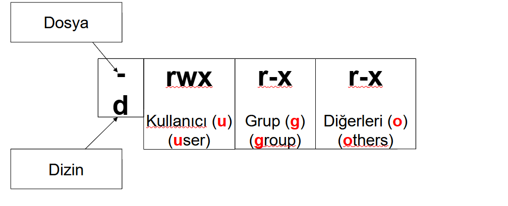

## TEMEL LİNUX KOMUTLARI

Linux Dosya Yapısı

```markdown
/               -> Kök dizini
├── bin/        -> Temel kullanıcı komutları (ls, cp, mv, cat, …)
├── boot/       -> Çekirdek ve önyükleme dosyaları (kernel, grub)
├── dev/        -> Donanım aygıt dosyaları (/dev/sda, /dev/null)
├── etc/        -> Sistem yapılandırma dosyaları/konfigürasyon (/etc/passwd, /etc/hosts)
├── home/       -> Kullanıcıların ev dizinleri (/home/ali, /home/bugra)
├── lib/        -> Paylaşımlı kütüphaneler (.so dosyaları)
├── media/      -> Çıkarılabilir ortamlar (USB, CD, DVD)
├── mnt/        -> Geçici bağlama noktaları (mount edilen dosya sistemleri)
├── opt/        -> Opsiyonel yazılımlar (3. parti paketler)
├── proc/       -> Çalışan süreçler ve sistem bilgileri (sanal dosya sistemi)
├── root/       -> Root kullanıcısının ev dizini
├── run/        -> Geçici çalışma zamanı dosyaları (PID dosyaları vs.)
├── sbin/       -> Sistem yönetim komutları (ifconfig, shutdown, …)
├── srv/        -> Sunucu servis verileri (örn: web, ftp)
├── sys/        -> Donanım ve çekirdek bilgileri
├── tmp/        -> Geçici dosyalar (yeniden başlatınca silinir)
├── usr/        -> Kullanıcıya ait uygulamalar ve kütüphaneler
│   ├── bin/    -> Kullanıcı uygulamaları (ls, grep, awk, …)
│   ├── sbin/   -> Yönetim uygulamaları
│   ├── lib/    -> Kütüphaneler
│   └── share/  -> Paylaşılan dosyalar (dökümantasyon, ikonlar)
└── var/        -> Değişken dosyalar (loglar, spool, cache)
    ├── log/    -> Sistem log dosyaları
    ├── mail/   -> E-posta verileri
    ├── spool/  -> Yazıcı ve e-posta kuyrukları
    └── tmp/    -> Geçici dosyalar

```


$ : Sizin sıradan (normal) kullanıcı olduğunuzu belirtir.

\# : Süper kullanıcı (root) olduğunuzu belirtir.

~ : Kullanıcının ev dizininde bulunduğunuzu belirtir

/ : Kök dizin (en üst seviye)

. : Bulunduğun mevcut dizin

.. : Bir üst dizin

\- : Bir önce bulunduğun dizin

~kullanici : Belirtilen kullanıcının home dizini (örn: ~root → /root)


### Linux Komut Yapısı

komut [seçenekler] [argümanlar]

Komut: Komutun kendisidir (işlev).

Seçenekler (Options): Komutun işlevini değiştirmeye yarar.  (-) işareti ile başlar.Uzun yazılış: Çift tire (--) tamamı yazarız.

* örnek

   -v  --verbose	İşlemin aşamalarını ayrıntılı 	gösterir.

Argümanlar (Arguments): Komutun üzerinde işlem yapacağı nesnedir. Örneğin dosya


---

# Linux Komutları ve Seçenekleri
## Seçenekler
- `-h`, `--help` → Komutun yardım ekranını gösterir  
- `-v`, `--version` → Komutun sürümünü gösterir  
- `-r` → Recursive (özyinelemeli işlem)  
- `-f` → Force (zorla çalıştırma)  
- `-i` → Interactive (işlemden önce sorar)  
- `-q` → Quiet (sessiz mod)  
- `-n` → Satır/limit belirtme (örn: `head -n 5`)  

# Linux Komutları

## 📂 ls (listeleme)

| Komut               | Açıklama                         |
|----------------------|----------------------------------|
| `ls`                | Bulunduğun dizindeki dosyaları listele |
| `ls -l`             | Ayrıntılı listeleme (izinler, boyut vb.) |
| `ls -a`             | Gizli dosyaları da göster        |
| `ls -la`             | Gizli dosyaları ayrıntılı listele        |
| `ls -lh`            | Boyutları okunabilir formatta    |
| `ls -laR `            | Boyutları okunabilir formatta    |
| `ls -l -a -R `         | Yukarıdakinden farkı yok
| `ls -R`             | Alt dizinleri de listele         |
| `ls -lt`             |  komutu dosyaları/dizinleri son değişiklik tarihine göre sıralar  |

---

## 📂 mkdir (Klasör oluşturma)

| Komut               | Açıklama                         |
|----------------------|----------------------------------|
| `mkdir -p ` | seçeneği ile kullanılarak tek bir seferde iç içe birden fazla dizin oluşturulabilir. |
| `mkdir --mode` |kullanıcının istediği erişim haklarına sahip dizinler yaratılabilir. |


## 📂 rmdir (Klasör silme)
rmdir komutu içi boş bir dizini silmek amacıyla kullanılır.

## rm (remove) Komutu
rm komutu dosya veya dizin silmek için kullanılır.

## mv (move) Komutu
Bir dosyanın/klasörün ismini değiştirmek ya da bir dosyayı/klasörü taşımak için mv komutu kullanılır. 

## 📄 cp (dosya kopyalama)

| Komut                   | Açıklama                        |
|--------------------------|---------------------------------|
| `cp dosya hedef/`       | Dosyayı hedefe kopyala          |
| `cp -r dizin hedef/`    | Dizini içindekilerle kopyala    |
| `cp -i dosya hedef/`    | Üzerine yazmadan önce sor       |
| `cp -f dosya hedef/`    | Zorla kopyala                   |
| `cp -v dosya hedef/`    | Kopyalanan dosyaları göster     |

---

## ✂️ rm (dosya/dizin silme)

| Komut                  | Açıklama                         |
|-------------------------|----------------------------------|
| `rm dosya.txt`          | Dosya sil                       |
| `rm -i dosya.txt`       | Silmeden önce sor                |
| `rm -f dosya.txt`       | Onay sormadan sil                |
| `rm -r dizin/`          | Dizini ve içindekileri sil       |
| `rm -rf dizin/`         | Onaysız, dizini komple sil       |


---

## 📑 cat / head / tail (dosya görüntüleme)

| Komut              | Açıklama                         |
|---------------------|----------------------------------|
| `cat dosya.txt`     | Dosyanın tamamını göster         |
| `cat -n  dosya.txt`     | Satırları numaralar.        |
| `cat > dosya.txt`     | dosya.txtnin içindeki metni sil yeni metni ekle     |
| `cat >> dosya.txt`     | dosya.txtnin içindeki metnin sonuna ekle   
| `head dosya.txt`    | İlk 10 satırı göster             |
| `head -n 5 dosya`   | İlk 5 satırı göster              |
| `tail dosya.txt`    | Son 10 satırı göster             |
| `tail -f dosya.txt`    | evamlı güncellenen log dosyalarını izlemek için kullanılır.   Ctrl+C ile sonlandırılır.         |

| `tac` | Dosya içeriğini ekrana tersten yazdırır.   |


---

## 🔍 grep (arama)

| Komut                         | Açıklama                            |
|-------------------------------|-------------------------------------|
| `grep kelime dosya.txt`       | Dosya içinde kelime ara             |
| `grep -i kelime dosya.txt`    | Büyük/küçük harf duyarsız arama     |
| `grep -r kelime /dizin/`      | Dizin içinde özyinelemeli arama     |
| `grep -n kelime dosya.txt`    | Satır numarasıyla göster            |

---
## echo(ekrana yazdırma) 
echo komutu Linux’ta ekrana çıktı vermek için kullanılır.
```bash
echo Merhaba Dünya
```
### Değişkenlerle Kullanım:
```bash
NAME="Bugra"
echo Merhaba $NAME
```
### Tık tırnak çift tırnak meselesi
Tek tırnak:

1. İçindeki her şeyi olduğu gibi yazar.

2. Değişkenler, $, \n, \t gibi özel karakterler çalışmaz.
```bash
NAME=Bugra
echo 'Merhaba $NAME'
```
Çıktı:

Merhaba $NAME

Çift Tırnak

1. İçindeki değişkenleri ve özel karakterleri işler.

2. Yani $ ile başlayan değişkenler yerine değerini koyar.
```bash
NAME=Bugra
echo "Merhaba $NAME"
```
Çıktı:

Merhaba Bugra


# Linux Kontrol Karakterleri

Linux ve Unix sistemlerinde terminal ve kabukta kullanılan bazı kontrol karakterleri şunlardır:

| Kontrol Karakter | Tuş Kombinasyonu | Açıklama |
|-----------------|-----------------|----------|
| `^C`            | Ctrl + C        | Çalışan işlemi durdurur 
| `^Z`            | Ctrl + Z        | Çalışan işlemi arka plana gönderir (suspend) |
| `^D`            | Ctrl + D      ▶️  | Girdi sonu (EOF), terminali kapatır veya girişi bitirir |
| `^S`            | Ctrl + S        | Terminali durdurur (flow control – durdurma) |
| `^Q`            | Ctrl + Q        | Terminali yeniden başlatır (flow control – devam) |
| `^U`            | Ctrl + U     ▶️   | Satırın başına kadar siler |
| `^K`            | Ctrl + K        | İmleçten satır sonuna kadar siler |
| `^W`            | Ctrl + W    ▶️    | Son kelimeyi siler |
| `^L`            | Ctrl + L    ▶️    | Terminal ekranını temizler (clear) |
| `^R`            | Ctrl + R        | Komut geçmişinde arama yapar |
| `^A`            | Ctrl + A     ▶️   | Satır başına gider |
| `^E`            | Ctrl + E      ▶️  | Satır sonuna gider |

> Not: `^` işareti, Ctrl tuşu ile birlikte basıldığını gösterir.

# Man Sayfasında Gezinme
* spacebar man sayfasının bir sonraki ekranını gösterir.

* return her basışta bir satır gösterir.

* b / PgUp bir ekran öncesine döner.

* f / PgDown bir ekran sonrasına gider.

* q man sayfasından çıkar.

*  /kelime yazılan kelimeyi bulunulan yerden itibaren ileriye doğru arar.

* /kelime yazılan kelimeyi bulunulan yerden itibaren ileriye doğru arar.

*  n aranan kelimenin bir sonraki geçtiği yeri gösterir.

* h tüm bu işlemler için yardım sunar.


# less Komutu
Dosya içeriğini sayfa sayfa veya satır satır gösterir.

Hareketler:

* spacebar		:	Bir sayfa ileri.

* enter	    		:	Bir satır ileri.

* b					:	Bir sayfa geri.

* q					:	Çık.

* /kelime		:	Belirtilen kelimeyi ara.

* n					:	Son aramayı yinele.

# Dosya Yolları

* Mutlak (Tam):	Kök klasöründen (/) başlayarak.

* Bağıl:				Bulunulan dizine göre. 

* .				:	İçinde bulunulan klasör.

* ..				:İçinde bulunulan klasörün bir üst klasörü.

* \-				:	Bir önceki klasör.

* ~				:	Mevcut kullanıcının ev klasörü.

* ~kullanıcı	:	Belirtilen kullanıcının ev klasörü.

* /   			:    Kök klasörü (dizini)


## Birkaç Örnek Komut

ls -la  ~/Desktop/kabuk masaüstündeki kabuk klasörünün içini detaylı listelerken gizli dosyalrıda göster.

ls -lt komutu dosyaları/dizinleri son değişiklik tarihine göre sıralar ve listeler.

~$ pwd normal kullanıcının home dizinin yolunu göster.

~# pwd root kullınıcısının ev dizinin göster.

cd /var/log  kök dizin → var dizini → log dizini.

cd ../.. komutu, bulunduğun dizinin bir üstünün bir üst dizinine geçer.

cd  ~ Direkt olarak kendi ev dizininize gidebilirsiniz.

cd   ~bugor bugor kullanıcısının kök dizini

cd   - En son bulunduğunuz dizine geri dön.

head -n 3 dosyaAdi  dosyanın ilk 3 satırını gösterir.

head -n -3 dosyaAdi son 3 satır hariç tümünü gösterir.


tail -n 3 dosyaAdi Dosyanın son 3 satırını gösterir.

tail -n +3 dosyaAdi Dosyanın 3. satırdan başlayarak sonuna kadar tümünü gösterir.

mv deneme.txt ~/Desktop deneme.txtyi desktop a taşı


---


# Erişim İzinleri




1️⃣ İzin Türleri

r (read) → okuma izni  /içeriğinin görüntülenmesine ve kopyalanmasına izin verilmesi

w (write) → yazma  /değiştirme izni  /içeriğinin değiştirilebilmesine ve silinebilmesine izin verilmesi

x (execute) → çalıştırma izni

2️⃣ Kullanıcı Grupları

Her dosya/klasör için izinler 3 farklı gruba tanımlanır:

Owner (kullanıcı / u) → dosyanın sahibi

Group (g) → dosyanın ait olduğu grup

Others (o) → diğer tüm kullanıcılar

Dosyaların ve dizinlerin erişim haklarını dosya ve dizin sahipleri ile sistemin root kullanıcısı değiştirebilir.

#### Örnek:

-rwxr-xr--

\- → dosya (d olsaydı klasör)

rwx → sahibi (user) okuma, yazma, çalıştırma yapabilir

r-x → gruptakiler okur ve çalıştırır ama yazamaz

r-- → diğer kullanıcılar sadece okuyabilir


Erişim hakkı değiştirme
```bash
chmod u+x dosya.sh   # Kullanıcıya çalıştırma izni ekler
chmod g-w dosya.txt  # Gruptan yazma iznini alır
chmod o=r dosya.txt  # Diğerleri sadece okuma yapabilir
```
Sayısal yöntem

r = 4	

w = 2	

x = 1
```bash

chmod 755 dosya.sh
```
7 = rwx (4+2+1) → kullanıcı

5 = r-x (4+1) → grup

5 = r-x (4+1) → diğerleri


Sahiplik Değiştirme
1️⃣ Kullanıcı değiştirme
```bash
chown ali dosya.txt
```
2️⃣ Kullanıcı + Grup değiştirme
```bash
chown ali:ogrenci dosya.txt
```
3️⃣ Sadece grup değiştirme
```bash
chown :ogrenci dosya.txt
```
4️⃣ Klasör ve içindekiler için (recursive)
```bash
chown -R ali:ogrenci /home/proje
```
📌 /home/proje klasörü ve içindeki tüm dosyaların sahibi ali:ogrenci yapılır.

4️⃣ Numara ile değiştirme 

chown  kullaniciNo:grupNo  dosyaAdi
```bash
chown  620:100 deneme.txt
```
# Wildcards
Komut satırında kullanılan ve Linux komutlarına argüman olarak verilebilecek özel semboller vardır.

Bu özellik, özellikle dosya arama, kopyalama, taşıma ve silme işlemlerinde çok faydalıdır.

#### \* → Sıfır veya daha fazla karakter
```bash
ls *.txt  # txt dosyalarını listele
```
a* yazımı, a karakteri ile başlayan bütün sözcükleri gösterir: a, araclar, a75 gibi...

*z yazımı ise z karakteri ile biten bütün sözcükleri ifade eder: z, az, a95z gibi...

re*m yazımı, re ile başlayıp m ile biten sözcükleri tanımlar: rem, resim, rengim, re57m gibi...
```bash

# İçinde "log" geçen tüm dosyalar
ls *log*
```
####  ? → Tek karakter/ boşluk ifadesi yok

```bash
ls ?.txt #Sadece tek karakterli dosya isimleri (a.txt, b.txt) eşleşir.
```
a? yazımı, a harfi ile başlayan 2 karakterli sözcükleri ifade eder. Burada (?) tek bir karakter yerine geçer: ab, a2, a+ gibi…

####  [] → köşeli parantez içerisindeki karakterlerden herhangi biri/boşluk ifadesi yok

```bash
ls file[1-3].txt #file1.txt, file2.txt, file3.txt ile eşleşir.
```

#### [! ] → Hariç tutma
```bash

ls file[!0-9].txt #İsmi file ile başlayıp son karakteri rakam olmayan dosyaları listeler.
```
#### { } → Küme parantezi ile seçenekler
```bash
ls {a,b,c}.txt #a.txt, b.txt, c.txt dosyalarıyla eşleşir.
```
```bash
ls [A-Z]* #Büyük harfle başlayan dizinler
```
```bash
ls D* # Bu komut "D" ile başlayan her şeyi listeler, ama dizinlerin içeriğini de gösterir:
```

Çıktısı

Documents:
file1.txt  file2.txt  subfolder/

Downloads:
movie.mp4  song.mp3  archive.zip

Desktop:
shortcut1  shortcut2  readme.txt

```bash
ls -d D* # Bu komut sadece dizin isimlerini listeler, içeriklerine girmez:
```
```bash
ls -d */  # Tüm dizinleri listele (içerik gösterme)
```


### NOT
Bunlar dosyaları listeler veya hiçbirini  bulunamazsa bir hata döndürür.
```bash
ls  *.txt  2>/dev/null
```

2>/dev/null: Komutun bu kısmı, stderr'i (hata mesajlarını) üzerine yazılan tüm verileri çöpe atan özel bir dosya olan /dev/null'a yönlendirir. Bu ise, ls'den gelen muhtemel hataları gizler.


###  expr (evaluate expressions) Komutu
```bash
# Toplama
expr 5 + 3        # Çıktı: 8

# Çıkarma
expr 10 - 4       # Çıktı: 6

# Çarpma (dikkat: * escape edilmeli)
expr 6 \* 7       # Çıktı: 42

# Bölme (integer division)
expr 15 / 3       # Çıktı: 5
expr 17 / 3       # Çıktı: 5 (kalan atılır)

# Mod (kalan)
expr 17 % 3       # Çıktı: 2

# Karşılaştırma İşlemleri
expr 5 = 5

a=10
b=3
expr $a + $b


```
expr için mantıksal VEYA | dir. Pipe karakteri ile karıştırılmasın diye \| şeklinde kullanılmalıdır.

expr için mantıksal VE & dir. Background process karakteri ile karıştırılmasın diye \& şeklinde kullanılmalıdır.

expr için küçüktür < dir. Yönlendirme karakteri ile karıştırılmasın diye \< şeklinde kullanılmalıdır.

expr için büyüktür > dir. Yönlendirme karakteri ile karıştırılmasın diye \> şeklinde kullanılmalıdır.


## String (Metin) İşlemleri
```bash
expr length "Bugra"
```
çıktı 
5
```bash
expr substr "BugraChat" 2 3
```
çıktı
ugr
```bash
expr index "Linux" n 
```
Çıktı: 
3 
(çünkü n 3. sırada)